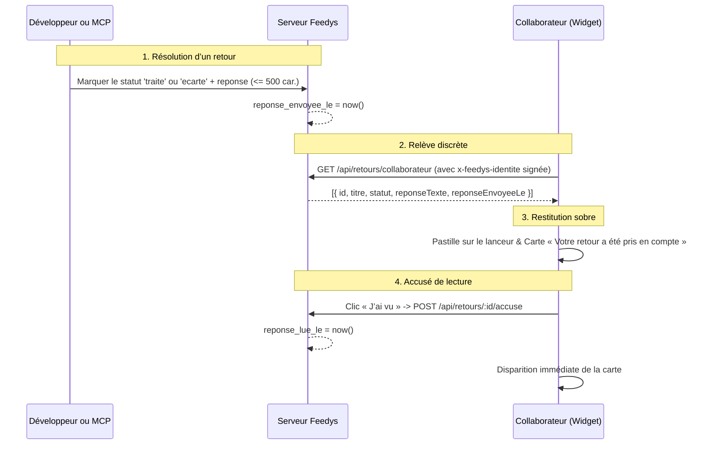

# Spécification — Le retour au collaborateur

## L’intention

Sans retour vers celui qui parle, Feedys est un **puits sans fond** : le collaborateur signale
des frictions, mais ne sait jamais si elles sont lues, comprises ou corrigées. Au bout de deux
semaines de silence, le geste de signalement s’éteint.

Or, Feedys a deux partis pris d’architecture fondamentaux ([VISION.md](../00-Projet/VISION.md),
[D-005](../00-Projet/DECISIONS_LOG.md), [D-007](../00-Projet/DECISIONS_LOG.md)) :
1. **Aucun compte utilisateur et aucune adresse email de collaborateur**. Feedys ne dispose que
   du tuple `{ ref, nom, role }` signé par l’hôte avec le secret du produit.
2. **Le refus catégorique du support client en direct et de la messagerie bidirectionnelle**.
   Feedys n’est pas un chat de support, pas une boîte d’assistance et pas un outil de messagerie.

Le retour au collaborateur résout cette équation : **permettre au développeur (ou à son agent de
code via MCP) d’informer le collaborateur que ce qu’il a signalé est corrigé ou pris en compte,
de manière sobre, discrète et strictement à sens unique.**

---

## Le cycle de vie d’une réponse



---

## 1. La persistance (données)

Trois colonnes sur la table `retours` ([0005_retour_collaborateur.sql](../db/migrations/0005_retour_collaborateur.sql)) :
- `reponse_texte text` (nullable, contrainte `check (char_length(reponse_texte) <= 500)`) :
  le mot court explicatif du développeur (ex. « Corrigé dans la version déployée ce matin »).
- `reponse_envoyee_le timestamptz` (nullable) : horodatage posé lors du passage au statut `traite`
  ou `ecarte`.
- `reponse_lue_le timestamptz` (nullable) : horodatage posé quand le collaborateur clique « J’ai vu ».

⛔ **Aucune colonne metadata fourre-tout.** Les champs sont typés, bornés et audités.

---

## 2. Le déclenchement au Back-office et dans le MCP

### Au Back-office (`/bo/r/:id`)
- Lors du changement de statut vers `traite` ou `ecarte`, un champ texte optionnel permet de
  saisir la réponse (500 caractères au plus).
- L’envoi met à jour `reponse_texte` et pose `reponse_envoyee_le = now()`.
- La fiche du retour affiche l’état de la notification : date d’envoi et date de lecture par
  le collaborateur.

### Dans le serveur MCP (`packages/mcp`)
- L’outil `marquer_retour` accepte une propriété optionnelle `reponse?: string` (bornée à 500
  caractères).
- L’agent Claude Code peut ainsi marquer un retour traité tout en formulant la phrase de
  résolution dans la même instruction de code.

---

## 3. L’API de relève (authentifiée par identité signée)

### `GET /api/retours/collaborateur`
- Reçoit `x-feedys-cle` et `x-feedys-identite`.
- Vérifie la signature HMAC-SHA256 du jeton d’identité avec le secret du produit.
- **Principe de tolérance pour l’anonymat** : si l’en-tête d’identité est absent ou invalide,
  la route répond `200` avec un tableau vide `[]`. Aucun collaborateur anonyme ne reçoit de
  notification, mais aucun flux hôte ne casse.
- Si l’identité est valide : sélectionne les retours du produit où `auteur_ref = identite.ref`,
  `reponse_envoyee_le IS NOT NULL` et `reponse_lue_le IS NULL`.
- Retourne :
  ```json
  [
    {
      "id": "ret_...",
      "titre": "Bouton de validation inactif",
      "statut": "traite",
      "reponseTexte": "Corrigé dans la mise à jour déployée ce matin.",
      "reponseEnvoyeeLe": "2026-09-07T08:30:00.000Z"
    }
  ]
  ```

### `POST /api/retours/:id/accuse`
- Reçoit `x-feedys-cle` et `x-feedys-identite`.
- Vérifie l’authenticité du jeton d’identité.
- Vérifie que le retour ciblé appartient bien au même produit et au même `auteur_ref` que
  l’identité signée. En cas de non-concordance, répond `404` (ne divulgue pas l’existence
  d’un retour tiers).
- Pose `reponse_lue_le = now()` de façon idempotente (répond `200` même si déjà lu).

---

## 4. La restitution dans le Widget (discrète et à sens unique)

Le widget applique strictement les règles d’intégration et d’ergonomie du produit :

1. **La pastille sur le lanceur fermé** :
   - Si une réponse non lue attend, une pastille discrète (`.lanceur__pastille`) apparaît sur
     l’icône du lanceur.
   - ⛔ Aucun pop-up intrusif, aucune bulle qui s’ouvre toute seule, aucun son.

2. **La carte sobre à l’ouverture** :
   - À l’ouverture du panneau, si des réponses attendent, une carte sobre (`.notification`)
     s’affiche en tête du corps :
     - Titre : « Votre retour sur « [Titre du retour] » a été pris en compte. » (ou « Votre retour a été pris en compte. » si le titre est absent).
     - Le mot du développeur (`reponseTexte`) s’il existe.
     - Un bouton unique d’action : **« J’ai vu »**.

3. **L’accusé de lecture** :
   - Cliquer sur « J’ai vu » envoie la requête `POST /api/retours/:id/accuse` et fait disparaître
     immédiatement la carte et la pastille.

4. ⛔ **Les interdits absolus dans le widget** :
   - ⛔ **Aucun champ de saisie de réponse**.
   - ⛔ **Aucun fil de discussion**.
   - ⛔ **Aucun bouton de relance**.
   - La notification est strictement à sens unique : l’information est transmise, l’accusé est
     donné, la boucle est bouclée.
   - La surface normale du widget (micro et champ texte d’un nouveau retour) reste intacte
     au-dessous.
   - Respect strict du budget de 60 Ko gzip de `widget.js`.
