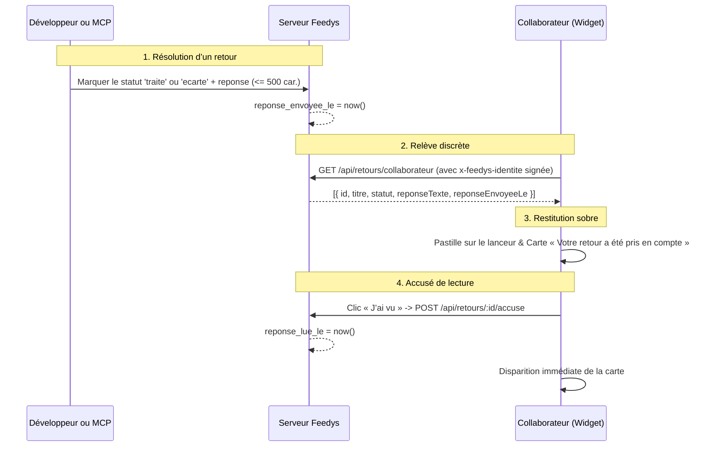

# Spécification — Le retour au collaborateur

## L’intention

Sans retour vers celui qui parle, Feedys est un **puits sans fond** : le collaborateur signale
des frictions, mais ne sait jamais si elles sont lues, comprises ou corrigées. Au bout de deux
semaines de silence, le geste de signalement s’éteint.

Or, Feedys a deux partis pris d’architecture fondamentaux ([VISION.md](../00-Projet/VISION.md),
[D-005](../00-Projet/DECISIONS_LOG.md), [D-007](../00-Projet/DECISIONS_LOG.md)) :
1. **Aucun compte utilisateur et aucune adresse email de collaborateur**. Feedys ne dispose que
   du tuple `{ ref, nom, role }` signé par l’hôte avec le secret du produit.
2. **Le refus catégorique du support client en direct et de la messagerie bidirectionnelle**.
   Feedys n’est pas un chat de support, pas une boîte d’assistance et pas un outil de messagerie.

Le retour au collaborateur résout cette équation : **permettre au développeur (ou à son agent de
code via MCP) d’informer le collaborateur que ce qu’il a signalé est corrigé ou pris en compte,
de manière sobre, discrète et strictement à sens unique.**

---

## Le cycle de vie d’une réponse



---

## 1. La persistance (données)

Trois colonnes sur la table `retours` ([0005_retour_collaborateur.sql](../db/migrations/0005_retour_collaborateur.sql)) :
- `reponse_texte text` (nullable, contrainte `check (char_length(reponse_texte) <= 500)`) :
  le mot court explicatif du développeur (ex. « Corrigé dans la version déployée ce matin »).
- `reponse_envoyee_le timestamptz` (nullable) : horodatage posé lors du passage au statut `traite`
  ou `ecarte`.
- `reponse_lue_le timestamptz` (nullable) : horodatage posé quand le collaborateur clique « J’ai vu ».

⛔ **Aucune colonne metadata fourre-tout.** Les champs sont typés, bornés et audités.

---

## 2. Le déclenchement au Back-office et dans le MCP

### Au Back-office (`/bo/r/:id`)
- Lors du changement de statut vers `traite` ou `ecarte`, un champ texte optionnel permet de
  saisir la réponse (500 caractères au plus).
- L’envoi met à jour `reponse_texte` et pose `reponse_envoyee_le = now()`.
- La fiche du retour affiche l’état de la notification : date d’envoi et date de lecture par
  le collaborateur.
- ⛔ **Le champ reste VIDE, même quand un mot est déjà parti.** Ici, vide veut dire « je n’y
  touche pas », pas « efface ». Le pré-remplir ferait renvoyer le même message à chaque
  correction d’étiquette. Ce qui est déjà parti se lit sous le formulaire.
- ⛔ **Un mot avec le statut `lu` est refusé, pas ignoré.** `lu` ne notifie personne :
  accepter le champ puis le jeter afficherait « enregistré » à quelqu’un qui vient d’écrire
  un message que personne ne lira.

### Dans le serveur MCP (`packages/mcp`)
- L’outil `marquer_retour` accepte une propriété optionnelle `reponse?: string` (bornée à 500
  caractères).
- L’agent Claude Code peut ainsi marquer un retour traité tout en formulant la phrase de
  résolution dans la même instruction de code.
- ⛔ **`marquer_retour` reste idempotent** (`idempotentHint: true`) : rejouer le même marquage
  n’efface pas le mot déjà parti et ne rouvre pas un accusé déjà donné. Voir §2 bis.
- ⛔ **Un mot avec le statut `lu` est refusé ici AUSSI**, exactement comme au back-office. Les deux
  chemins refusent la même chose : c’est ce qui permet de ne se rappeler qu’une seule règle.
- ⚠️ Depuis P-024, le même appel porte **`correctif`** — ce qui a réparé, pour le développeur —
  et il est **exigé pour `traite`**. ⛔ `reponse` et `correctif.note` ne se recopient jamais l’une
  dans l’autre : deux publics, deux langues. Tout est dans
  [tracabilite-du-correctif.md](tracabilite-du-correctif.md).

### 2 bis. ⛔ Une réponse ne se re-notifie pas, et ne s’efface pas toute seule

Les deux chemins — back-office et MCP — écrivent par le **même** module
([`infra/base/sql-statut.ts`](../apps/serveur/infra/base/sql-statut.ts)), et ils tiennent trois
règles :

| Le geste | Ce qui arrive au collaborateur |
|---|---|
| Marquer `traite` avec un mot **nouveau** | La notification part (ou repart) |
| Reposer le **même** statut avec le **même** mot | Rien. Il ne revoit pas la carte |
| Marquer `traite` **sans** fournir de mot | Rien n’est effacé ; il n’est notifié que s’il ne l’avait jamais été |

⚠️ Ce n’est pas du confort. Sans ces règles, corriger une étiquette six semaines plus tard
ressortait la carte à quelqu’un qui avait déjà tourné la page — exactement le harcèlement
poli que Feedys refuse d’être.

---

## 3. L’API de relève (authentifiée par identité signée)

### `GET /api/retours/collaborateur`
- Reçoit `x-feedys-cle` et `x-feedys-identite`.
- ⛔ **Le widget n’appelle PAS sans jeton d’identité.** Le serveur rendrait `[]` de toute
  façon : l’appel n’apprendrait rien et partirait pourtant à chaque chargement de page de
  l’hôte, visiteur de passage compris.
- ⛔ **`cache-control: no-store, private`** et `vary` sur l’en-tête d’identité. Cette liste
  est celle d’UNE personne, sur une URL fixe, sans cookie : un proxy d’entreprise — et Feedys
  vit derrière des proxys d’entreprise — servirait sinon la liste d’Alice à Bob.
- Limitation de débit **large et délibérément large** (`DEBIT_COLLABORATEUR`) : les
  collaborateurs d’un même bureau sortent par la même IP publique. Elle arrête une boucle de
  rendu partie en vrille, pas un étage un mardi matin.
- Vérifie la signature HMAC-SHA256 du jeton d’identité avec le secret du produit.
- **Principe de tolérance pour l’anonymat** : si l’en-tête d’identité est absent ou invalide,
  la route répond `200` avec un tableau vide `[]`. Aucun collaborateur anonyme ne reçoit de
  notification, mais aucun flux hôte ne casse.
- Si l’identité est valide : sélectionne les retours du produit où `auteur_ref = identite.ref`,
  `reponse_envoyee_le IS NOT NULL` et `reponse_lue_le IS NULL`.
- ⛔ **Et de moins de trente jours.** Une réponse jamais lue s’éteint : sans borne, la pastille
  reste posée des mois sur le widget de quelqu’un qui ne l’ouvrira plus, et une pastille qui
  persiste sans être réclamée devient une obligation — le badge de non-lus que D-021 dit ne
  PAS être. ⚠️ La ligne n’est pas touchée : c’est la relève qui cesse, pas la trace. Le
  back-office la lit toujours.
- Retourne :
  ```json
  [
    {
      "id": "ret_...",
      "titre": "Bouton de validation inactif",
      "statut": "traite",
      "reponseTexte": "Corrigé dans la mise à jour déployée ce matin.",
      "reponseEnvoyeeLe": "2026-09-07T08:30:00.000Z"
    }
  ]
  ```

### `POST /api/retours/:id/accuse`
- Reçoit `x-feedys-cle` et `x-feedys-identite`.
- Vérifie l’authenticité du jeton d’identité.
- Vérifie que le retour ciblé appartient bien au même produit et au même `auteur_ref` que
  l’identité signée. En cas de non-concordance, répond `404`.
- ⛔ **Le retour d’autrui est INDISCERNABLE du retour inexistant** : même statut, même motif
  (`retour_inconnu`), même message. Un `403` distinct, ou un motif `auteur_refuse`, ferait de
  cette route un oracle où n’importe quel collaborateur du produit énumère les identifiants de
  ses collègues.
- Pose `reponse_lue_le = now()` de façon idempotente (répond `200` même si déjà lu).

---

## 4. La restitution dans le Widget (discrète et à sens unique)

Le widget applique strictement les règles d’intégration et d’ergonomie du produit :

1. **La pastille sur le lanceur fermé** :
   - Si une réponse non lue attend, une pastille discrète (`.lanceur__pastille`) apparaît sur
     l’icône du lanceur.
   - ⛔ Aucun pop-up intrusif, aucune bulle qui s’ouvre toute seule, aucun son.

2. **La carte sobre à l’ouverture** :
   - ⛔ **Trois cartes au plus.** Le panneau sert à PARLER ; les cartes y sont un invité. Un
     développeur qui solde dix vieux retours d’un coup — le geste le plus banal — pousserait
     sinon le micro hors de l’écran. Les suivantes prennent la place au fur et à mesure des
     « J’ai vu ».
   - ⛔ **Et jamais de « et 7 autres ».** Compter est précisément ce que D-021 s’interdit :
     rien n’annonce combien il en reste.
   - À l’ouverture du panneau, si des réponses attendent, une carte sobre (`.notification`)
     s’affiche en tête du corps :
     - Titre : « Votre retour sur « [Titre du retour] » a été pris en compte. » (ou « Votre retour a été pris en compte. » si le titre est absent).
     - Le mot du développeur (`reponseTexte`) s’il existe.
     - Un bouton unique d’action : **« J’ai vu »**.

3. **L’accusé de lecture** :
   - Cliquer sur « J’ai vu » envoie la requête `POST /api/retours/:id/accuse` et fait disparaître
     immédiatement la carte et la pastille.
   - ⚠️ Le widget retient ce qui vient d’être acquitté pour la durée de la page. Sans cela,
     une relève encore en vol — celle de l’ouverture du panneau — se résout après le clic,
     avec la liste d’AVANT, et remet la carte.

4. ⛔ **Les interdits absolus dans le widget** :
   - ⛔ **Aucun champ de saisie de réponse**.
   - ⛔ **Aucun fil de discussion**.
   - ⛔ **Aucun bouton de relance**.
   - La notification est strictement à sens unique : l’information est transmise, l’accusé est
     donné, la boucle est bouclée.
   - La surface normale du widget (micro et champ texte d’un nouveau retour) reste intacte
     au-dessous.
   - Respect strict du budget de 60 Ko gzip de `widget.js`.
